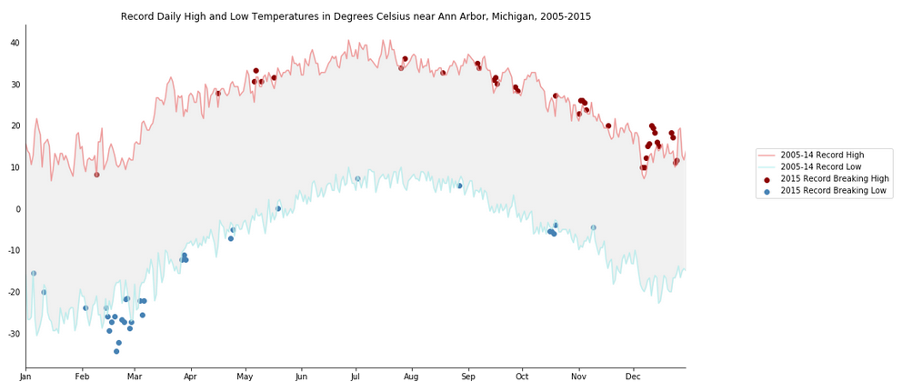

# Record Daily High and Low Temperatures in Degrees Celsius near Ann Arbor, Michigan, 2005-2015

Figure 1. The data used in Figure 1 are daily records of high and low temperatures in degrees Celsius from the ten-year-period of 2005-2015. The data was collected at a variety of weather stations surrounding Ann Arbor, Michigan. The daily record high and record low temperatures for the period of 2005-2014 are plotted as line graphs. Daily 2015 high and lows that exceed records from the 2005-2014 period are scatter plotted. Of note, is that 2015 had an unusually warm December and cold February.

## Viewing the Jupyter Notebook
The [https://github.com/bmare/Record-Daily-High-and-Low-Temperatures-in-Degrees-Celsius-near-Ann-Arbor-Michigan-2005-2015/blob/master/assignment2.ipynb] for this project can be viewed by copying the link into [https://nbviewer.org/].

## Data Source
The data used is an NOAA dataset of daily maximum and minimum temperatures collected at weather stations near Ann Arbor, Michigan over the period from 2005 to 2015.
